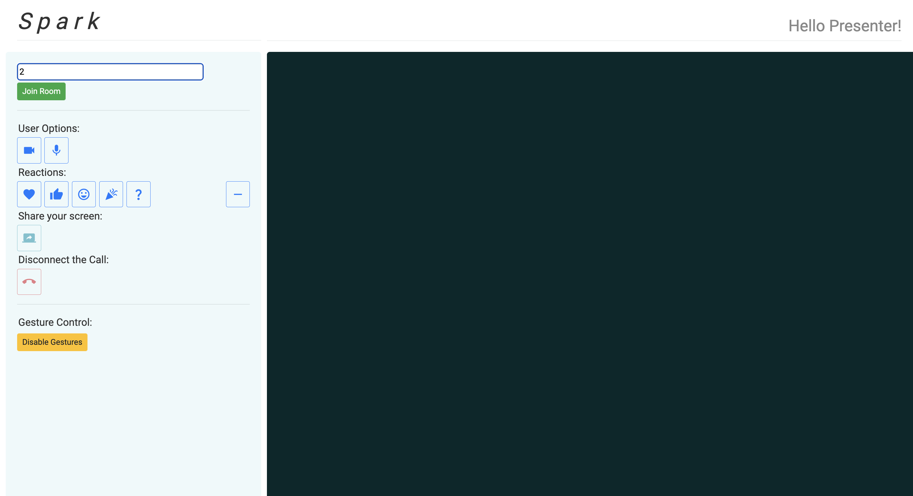
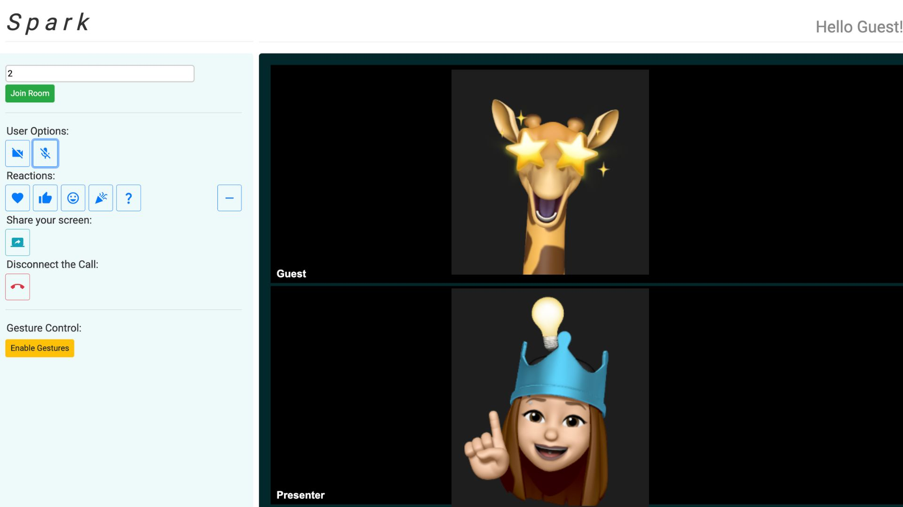
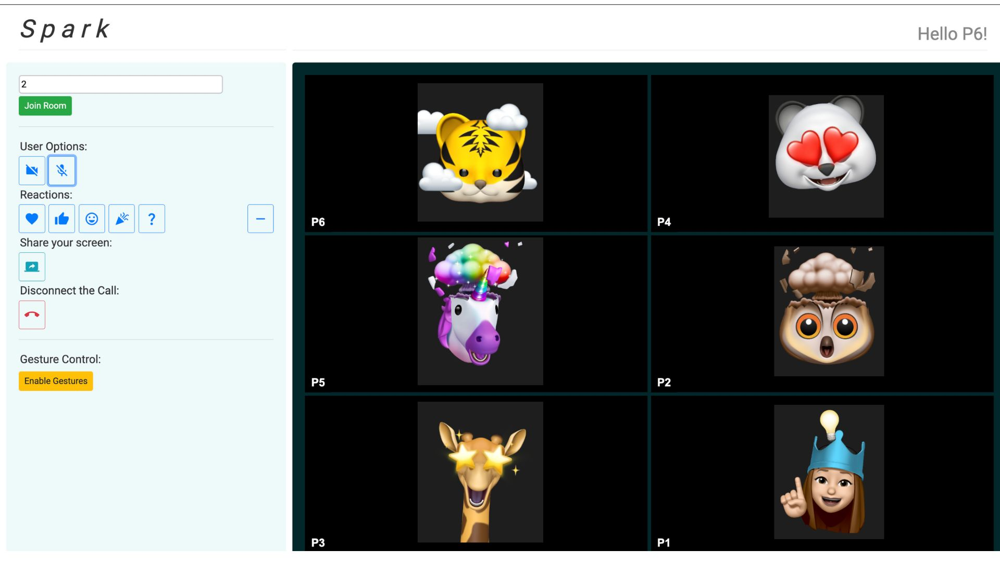

<h3 align="center">
  
  

<a href="README.md">Overview</a> | <a href="INSTALL.md">Installation</a> | <a href="/docs/project_roadmap.md">Long Term Objectives</a>

[](https://github.com/SiddarthR56/spark/actions/workflows/build.yml)
[](https://github.com/SiddarthR56/spark/actions/workflows/lint.yml)
[](https://github.com/SiddarthR56/spark/actions/workflows/test.yml)

[](https://zenodo.org/badge/latestdoi/540260143)
[](https://opensource.org/licenses/MIT)

</h3>

We have the best hands free solution to your presentation needs! Have you ever presented to an audience and not had the ability to interact and change your meeting controls on the go? Spark is a solution to use gestures to change your volume and screen sharing settings while you present. You no longer need to type a value, instead just give your camera a gesture or react on the go during presentations. We guarantee it will _spark_ new conversations and be the most seemless, hands-free presentation you have had!

## Capabilities

- Allows multiple users to join a video conferencing web application
- Provides capabilities for user to be able to use gestures to manipulate the web conferencing interface.
  - Show a thumbs up **to change volume**
  - Swipe left or right to interact with your **screen sharing capabilities**.
  - Closed fist **to close the camera**
  - Closed fist with the thumb and little finger out **to disconnect the call**

<h1 align="center">


</h1>

- Provides capability for a user to react during a video call. Reactions offered include:
  - Favorite
  - Agree
  - Happy
  - Celebration
  - Question?
  - Remove

<h1 align="center">


</h1>
## Demo Video

<h1 align="center">


<h1>

## Worked Examples

1. User is directed to the homepage where they are asked to enter a room number they would like to join. If the room does not already exist, a new room will be created for the user, for example, Room 2 is created in our case here.
<h1 align="center">
  
</h1>

2. If another person wishes to join the room, they can simply enter the same room number to join the room. Currently, the application supports volume functions for mute/unmute, video on/off, and screen share functionality. Gesture recognition is enabled by default for the mute/unmute and screen sharing functionalities.
<h1 align="center">
  
  
</h1>

3. Users can leverage capabilities such gestures mentioned in the capabilities and react during conversations. In addition, users will also be able to disable gesture recognition by clicking the <b>Disable Gestures<b> button.

## Use

Setup and installation instructions can be found in the [user-friendly install guide](INSTALL.md)

## Testing / Coverage

Visit our [results page](/docs/results.md) for more information regarding running our test and code coverage scripts.

## Directory Structure

```
.
|   .eslintrc.json
|   .gitignore
|   CITATION.cff
|   CODE_OF_CONDUCT.md
|   CONTRIBUTING.md
|   LICENSE
|   INSTALL.md
|   README.md
|   package.json
|   package-lock.json
|   server.js
|   client.js
|   hand_gesture.js
|   webrtcpage.html
|
+---.github
|   \---workflows
|           build.yml
|           test.yml
|           lint.yml
|           codeql-analysis.yml
|   \---ISSUE_TEMPLATE
|           bug_report.md
|           feature_request.md
|
+---static
|   \---css
|       | style.css
|
+---scripts
|   cov_parser.py
|   help.py
|
+---docs
|   |   filetree.txt
|   |   project_roadmap.md
|   |   proj1rubric.md
|   |   proj1rubricComments.pdf
|   |   troubleshooting_guide.md
|   |   results.md
|   |   spark_demo.mp4
|   \---documentation_photos
|           *lots of photos listed not shown here*
|
+---out
|   |   index.html
|   \---fonts
|   \---scripts
|   \---styles
|
\---test
    |   test.js
```

## Contributing

Are you interested in contributing to this project? Visit [our contribution](CONTRIBUTING.md) documentation.
This project is made possible by the incredible donation of time from NC State Project Contributors and the advice/support of CSC 510 teaching staff. NC State University has made the resources for this project possible, and will continue to support CSC 510 projects for the forseeable future.

## Support

In case of any queries and for additional help, please email us at: help.sparkV2@gmail.com

## Meet the Team

<h1 align="center">

</h1>
